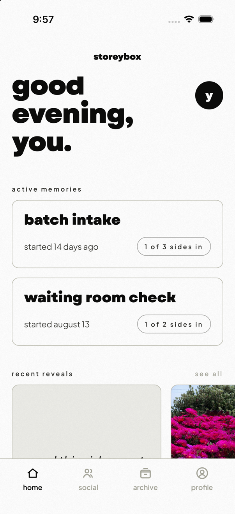
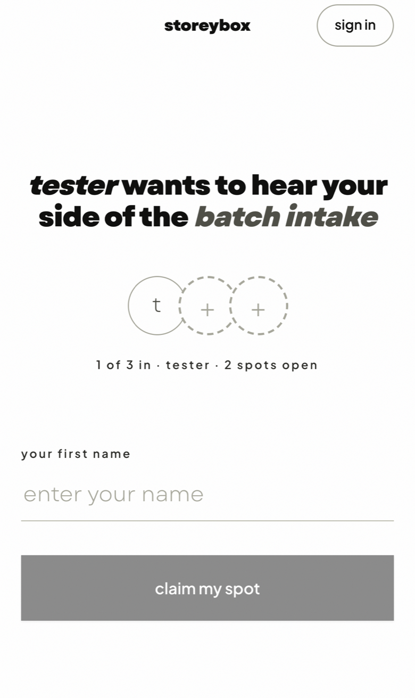
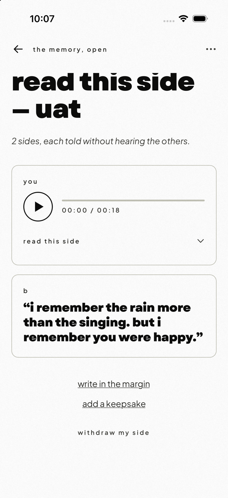
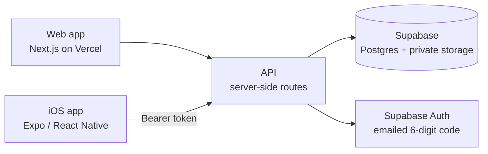

# Circles

**Shared memories, told from every side.**

Circles is a small app by [Storeybox](https://storeybox.club) for the moments
a group lived through together. One person starts a memory and records their
side of it. The others join through a single shared link and record *blind*:
nobody hears anything until everyone has spoken. Then the memory unlocks for
the whole circle at once, and you hear every side together.

This repo describes the product and how it is built. The source for the two
apps is private.

  
  &nbsp;
  
  &nbsp;
  

Left: the iOS app's Home. Middle: the web page a guest lands on from an invite link. Right: a memory after it unlocks, every side together.

## How a circle works

1. **Start a memory.** Give it a name, choose the circle (two to four people),
   and record your side. A side is a spoken recording of up to ten minutes.
2. **Invite the others.** You get one link to share. Anyone who opens it can
   claim a seat in the circle and record without installing anything.
3. **Record blind.** Each person records their side without hearing the
   others. A nudge is the only way to hurry someone along, and the person
   who started the memory can close the circle early if a seat stays empty.
4. **Wait.** The memory stays sealed until the last side is in.
5. **Unlock.** When everyone has spoken, the memory unlocks for all of them
   at the same moment, and everyone gets to hear it together.
6. **Keep it.** After the unlock, the circle can add photos and videos,
   annotate a side, and mark a memory as a keepsake on their shelf.

The blind rule is enforced in the database, not just in the interface. A
recording cannot be read by anyone in the circle until the memory has
unlocked.

## Two apps, one product

**The web app** is the front door. Invite links open there, so a guest can
listen to the invitation, claim a seat, and record a side on the page they
landed on. Sealing a side takes one email address and a six-digit code, with
no password. The web app also holds the
[Terms](https://storeyloops.vercel.app/terms) and
[Privacy](https://storeyloops.vercel.app/privacy) pages.

**The iOS app** is the signed-in home. It shows your active circles, the
memories that have unlocked, your shelf of keepsakes, and what your friends
have chosen to share. It sends a push notification the moment a memory
unlocks. Sign-in is the same emailed six-digit code.

Both apps talk to the same server, so a circle started on the web and a
circle started on the phone are the same thing.

## What Circles will not do

- **No summaries, no synthesis.** The unlock is raw playback of every side,
  in each person's own voice. Nothing rewrites or condenses a memory.
- **No trackers.** There are no analytics SDKs or third-party pixels. The
  only usage data is first-party and used to see whether people finish the
  loop.
- **Private by default.** A memory belongs to the people in it. Sharing an
  unlocked memory with a friend is opt-in, one memory at a time.
- **No unsolicited notifications.** The only push the app sends on its own is
  the unlock. Everything else is a person nudging a person.
- **Reporting and blocking are built in.** A block is mutual: neither person
  sees the other's content anywhere.

## Under the hood

- **Web app:** Next.js App Router on Vercel. It serves the public pages and
  every API route the iOS app calls.
- **iOS app:** Expo and React Native with Expo Router. It never touches the
  database directly. Every byte of data moves through the web app's API with
  a bearer token.
- **Data:** Supabase Postgres with row-level security policies that encode
  the blind guarantee, plus private storage for recordings and media served
  through short-lived signed URLs.
- **Auth:** Supabase Auth, email only. The web app also accepts a magic
  link; the iOS app takes the code only.
- **Design:** One design system shared by both apps, with the iOS app
  generating its tokens from the same source the web uses.

## Status

As of September 2026:

- The web app is at **v0.5** and in real user testing.
- The iOS app is heading to a **TestFlight beta**. iOS only for now; there is
  no Android build.

## About

Circles is made by Storeybox. The product source lives in private
repositories; this repo is the public description.
